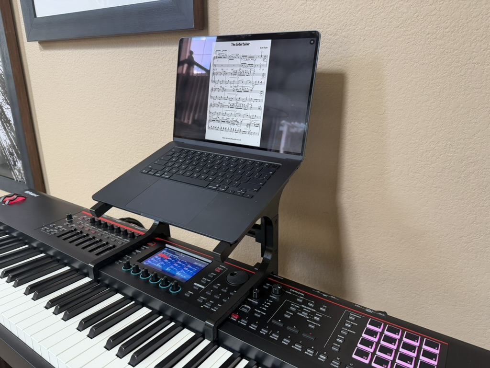
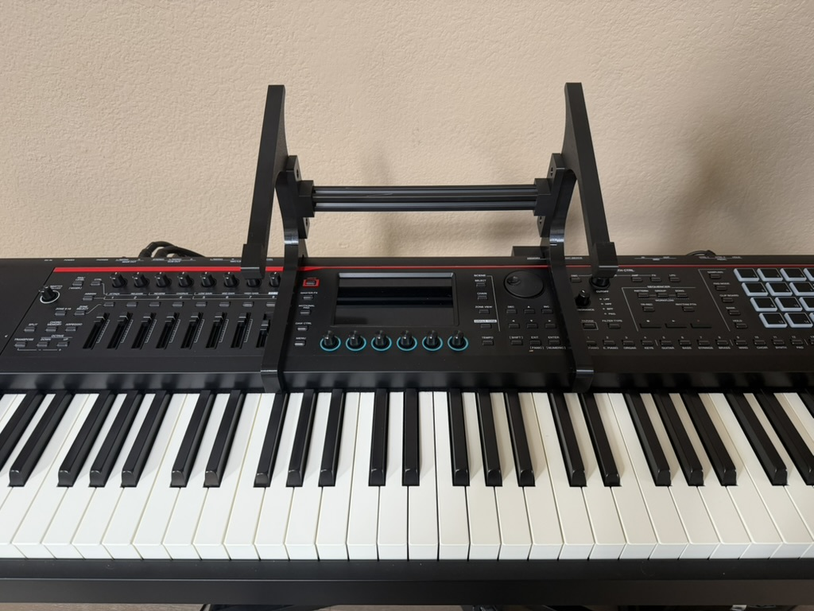
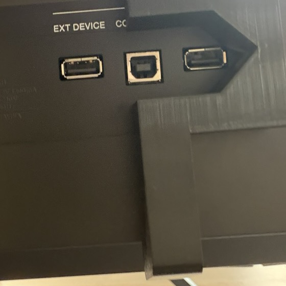

# Fantom-08 laptop stand



Clip-on laptop stand for a Roland Fantom-08. Print two brackets; they hook over the rear
panel and under the case bottom at the two clear spots on the panel. Laptop sits on the
15° tray. An optional cross brace (a 2020 aluminum extrusion between the brackets) stiffens
the pair side-to-side.

Design lives in Onshape: `Part Studio 1` is the source profile (one sketch + 15 mm extrude).
`Fantom Stand - Bracket 1.2 split` and `Fantom Stand - Brace mount` are generated.

| | |
|---|---|
|  |  |

## Print

The bracket is 286 mm tall — too big for a 256 mm bed — so it's split on the post with an
86 mm half-lap joint. Print one **A** set and one **B** set (B is mirrored so that, with the
brackets facing each other, both keep their nut pockets on the outer face and a flat inner
face for the brace plate). A halves only mate with A, B with B — the lap is handed.

| file | size (mm) | qty | lay on bed |
|---|---|---|---|
| `exports/bracket_bottom_A.stl` / `_B` | 200 × 221 × 15 | 1 each | nut-pocket face down |
| `exports/bracket_top_A.stl` / `_B` | 213 × 144 × 15 | 1 each | plain face down (tongue step up) |
| `exports/bracket_bottom_B_usb.stl` | 200 × 221 × 46 | instead of `_B` on a Fantom-08 | nut-pocket face down |
| `exports/brace_mount.stl` | 28 × 90 × 20 | 2 | flat back down |

The player's-right bracket lands on the rear USB cluster, so its bottom half is `_B_usb`: the post
is cut away over the port band (28 mm wide, 6 mm vertical margin on your 54 / 28 mm measurements)
and rerouted as a hump on the inner face with a 45° gable roof, so it still prints flat with no
supports. Constants are at the bottom of `tools/split.py` if the ports sit elsewhere.

Flat, no supports. PETG, 4+ walls, 30 %+ infill. Layers run along the post and tray, which
is the strong direction; never print these standing up.

### Replacement bottoms: more key clearance (2026-09-16)

The downward key-facing hook is now **2.5 mm shorter** (17.5 mm below the arm,
previously 20 mm). The 170 mm opening, top halves, lap joints, brace attachment and
USB window remain unchanged. Existing owners only need to reprint the two bottoms.

Open [bottom_brackets_key_clearance_X2D.3mf](exports/bottom_brackets_key_clearance_X2D.3mf)
in Bambu Studio and print **both plates**: plate 1 is right B with USB clearance;
plate 2 is left A. They are already flat, nut-pocket face down. PETG, 0.4 mm nozzle,
0.20 mm layers, 4 walls, 30% infill, **no supports**. Estimated total: **137 g / 3 h 53 min**.
Select your actual bed and PETG, then re-slice; the project contains no cached G-code.
Check clearance with the nearby keys released and pressed after installation.

The source Onshape export is retained; `HOOK_SHORTEN` in `tools/split.py` applies
this trim on regeneration. CAD comparison confirmed only the hook tips changed,
upper STLs are byte-identical, and both bottoms sliced without mesh repairs or
skipped/out-of-bed objects. [Verification record](exports/bottom_reprint_check.json).

### Fully printable brace (alternative to the extrusion)

No aluminum, no extra fasteners: a telescoping square tube that plugs into the same brace
plate sockets and is captive once the brackets are mounted. Measure plate face to plate
face, set `SPAN` in `tools/brace_beam.py`, run it, print what it lists (1, 2, or 3 pieces
depending on span; up to ~625 mm). Tube bores have a 45° roof — insert rods roof-up.
Lighter duty than the extrusion; use the extrusion if the frame ever feels rubbery.

### Fit coupons

`tools/coupons.py` generates thin (5 mm) slices of the clamp profile with the opening
(rear wall → keybed lip) enlarged by +1.0/+1.5/+2.0/+2.5 mm —
`exports/coupon_plus*.stl`, size engraved on each. Print flat, 2 walls / ~10 % infill.
The stretch is mid-arm only; post, foot, and joint are untouched, so the winning delta
can be applied to the arm length in the source sketch without breaking the lap joint.
The +1.0 coupon won (2026-09-06): the sketch now has the opening at 170 mm, and the arm
over the rear panel was dropped from 20 to 12 mm tall at the same time — it only bears on
the panel and pulls on the lip, and the lower bar is ~5× easier to spring on and blocks
less of the panel. Coupons are still cut from the current profile if you need to re-run.

## Hardware

- 4 × M4 pan head, **×20 without brace / ×25–30 with brace** (2 per bracket; they are the
  lap-joint bolts, and with the brace the same bolts also hold the brace plates)
- 4 × M4 hex nut — drops into the hex pocket on the bracket's outer face
- 1 × 2020 aluminum extrusion (European standard, 6 mm slot), cut to plate face to plate
  face + 2 × 10 mm sockets, a couple of mm short: **260 mm** for the measured 11⅛" (282.6 mm)
  bracket spacing (plate faces 242.6 apart)
- optional: 2 × M5 × 16 pan head, self-tapped into the extrusion's ~4.2 mm center bore
  through the back of each brace plate (the extrusion is already captive once both brackets
  are mounted; the screws only matter if you want the frame rigid off the keyboard)

Example Amazon (US) sources, checked 2026-08-30: M4 assortment kit with nuts+washers
[B08FQRWWCM](https://www.amazon.com/dp/B08FQRWWCM) ~$9 · 2020 extrusion 2×1000 mm
[B08934HPRR](https://www.amazon.com/dp/B08934HPRR) ~$30 (or ZYLtech
[B07Z787MB8](https://www.amazon.com/dp/B07Z787MB8)) · M5×16
[B009TE2OMU](https://www.amazon.com/dp/B009TE2OMU). Any European-standard 2020 with a
6 mm slot works; if the M5 spins in the bore, tap it M5 or use thread-locker.

## Assembly

1. Slide each bracket's tongues together (A with A, B with B).
2. Braceless: M4×20 from the plain face, nut in the hex pocket, tighten. Done.
3. With brace: screw the extrusion into the two brace plates first (optional M5s through
   the plate backs), then bolt each plate over a bracket's inner face — M4×25 through
   plate + bracket, head sunk in the plate's counterbore, nut in the bracket's hex pocket.

## Regenerate after editing the profile

```
.venv/bin/python tools/fetch_step.py   # pulls exports/bracket_current.step from Onshape
.venv/bin/python tools/split.py
.venv/bin/python tools/brace.py
```

`tools/onshape.py` is a tiny authenticated GET/POST wrapper (creds in
`~/.config/onshape/credentials.env`). Joint and brace parameters (lap span, bolt positions,
clearances, socket size) sit at the top of `split.py` / `brace.py`; bolt positions must match
between the two.

## License

Models, exports, and code: [CC BY 4.0](LICENSE). Print it, remix it, sell it; just credit
Abe Demcho and link back here.
